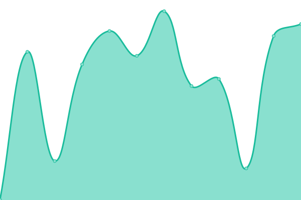

# [📈 Live Status](https://status.bricks4kidz.com): <!--live status--> **🟧 Partial outage**

This repository contains the open-source uptime monitor and status page for [Ajmal Alavi](https://status.bricks4kidz.com), powered by [Upptime](https://github.com/upptime/upptime).

With [Upptime](https://upptime.js.org), you can get your own unlimited and free uptime monitor and status page, powered entirely by a GitHub repository. We use [Issues](https://github.com/ajmalalavi/B4K-Site-monitor/issues) as incident reports, [Actions](https://github.com/ajmalalavi/B4K-Site-monitor/actions) as uptime monitors, and [Pages](https://status.bricks4kidz.com) for the status page.

<!--start: status pages-->
<!-- This summary is generated by Upptime (https://github.com/upptime/upptime) -->
<!-- Do not edit this manually, your changes will be overwritten -->
<!-- prettier-ignore -->
| URL | Status | History | Response Time | Uptime |
| --- | ------ | ------- | ------------- | ------ |
|  [CORP](https://www.bricks4kidz.com) | 🟩 Up | [corp.yml](https://github.com/ajmalalavi/B4K-Site-monitor/commits/HEAD/history/corp.yml) | 

 658ms
     
 | 

<a href="https://status.bricks4kidz.com/history/corp">99.79%</a>
    

|  [US](https://www.bricks4kidz.us) | 🟩 Up | [us.yml](https://github.com/ajmalalavi/B4K-Site-monitor/commits/HEAD/history/us.yml) | 

 898ms
     
 | 

<a href="https://status.bricks4kidz.com/history/us">99.64%</a>
    

|  [PANAMA](https://www.bricks4kidz.com.pa) | 🟩 Up | [panama.yml](https://github.com/ajmalalavi/B4K-Site-monitor/commits/HEAD/history/panama.yml) | 

 858ms
     
 | 

<a href="https://status.bricks4kidz.com/history/panama">99.79%</a>
    

|  [MALTA](https://www.bricks4kidz.mt) | 🟩 Up | [malta.yml](https://github.com/ajmalalavi/B4K-Site-monitor/commits/HEAD/history/malta.yml) | 

 2270ms
     
 | 

<a href="https://status.bricks4kidz.com/history/malta">97.89%</a>
    

|  [IRELAND](https://www.bricks4kidz.ie) | 🟩 Up | [ireland.yml](https://github.com/ajmalalavi/B4K-Site-monitor/commits/HEAD/history/ireland.yml) | 

 1346ms
     
 | 

<a href="https://status.bricks4kidz.com/history/ireland">97.90%</a>
    

|  [LUXEMBURG](https://www.bricks4kidz.lu) | 🟩 Up | [luxemburg.yml](https://github.com/ajmalalavi/B4K-Site-monitor/commits/HEAD/history/luxemburg.yml) | 

 1268ms
     
 | 

<a href="https://status.bricks4kidz.com/history/luxemburg">97.91%</a>
    

|  [INDIA](https://www.bricks4kidz.in) | 🟩 Up | [india.yml](https://github.com/ajmalalavi/B4K-Site-monitor/commits/HEAD/history/india.yml) | 

 1043ms
     
 | 

<a href="https://status.bricks4kidz.com/history/india">99.35%</a>
    

|  [FRANCE](https://www.bricks4kidz.fr) | 🟩 Up | [france.yml](https://github.com/ajmalalavi/B4K-Site-monitor/commits/HEAD/history/france.yml) | 

 1500ms
     
 | 

<a href="https://status.bricks4kidz.com/history/france">97.93%</a>
    

|  [CHILE](https://www.bricks4kidz.cl) | 🟩 Up | [chile.yml](https://github.com/ajmalalavi/B4K-Site-monitor/commits/HEAD/history/chile.yml) | 

 618ms
     
 | 

<a href="https://status.bricks4kidz.com/history/chile">99.79%</a>
    

|  [POLAND](https://www.bricks4kidz.com.pl) | 🟩 Up | [poland.yml](https://github.com/ajmalalavi/B4K-Site-monitor/commits/HEAD/history/poland.yml) | 

 2491ms
     
 | 

<a href="https://status.bricks4kidz.com/history/poland">97.93%</a>
    

|  [SWITZERLAND](https://www.bricks4kidz.ch) | 🟩 Up | [switzerland.yml](https://github.com/ajmalalavi/B4K-Site-monitor/commits/HEAD/history/switzerland.yml) | 

 1476ms
     
 | 

<a href="https://status.bricks4kidz.com/history/switzerland">97.95%</a>
    

|  [SINGAPORE](https://www.bricks4kidz.sg) | 🟩 Up | [singapore.yml](https://github.com/ajmalalavi/B4K-Site-monitor/commits/HEAD/history/singapore.yml) | 

 1131ms
     
 | 

<a href="https://status.bricks4kidz.com/history/singapore">99.35%</a>
    

|  [MALAYSIA](https://www.bricks4kidz.my) | 🟩 Up | [malaysia.yml](https://github.com/ajmalalavi/B4K-Site-monitor/commits/HEAD/history/malaysia.yml) | 

 1993ms
     
 | 

<a href="https://status.bricks4kidz.com/history/malaysia">99.35%</a>
    

|  [AUSTRIA](https://www.bricks4kidz.at) | 🟥 Down | [austria.yml](https://github.com/ajmalalavi/B4K-Site-monitor/commits/HEAD/history/austria.yml) | 

 0ms
     
 | 

<a href="https://status.bricks4kidz.com/history/austria">0.00%</a>
    

|  [MEXICO](https://www.bricks4kidz.mx) | 🟩 Up | [mexico.yml](https://github.com/ajmalalavi/B4K-Site-monitor/commits/HEAD/history/mexico.yml) | 

 612ms
     
 | 

<a href="https://status.bricks4kidz.com/history/mexico">99.79%</a>
    

|  [MONGOLIA](https://www.bricks4kidz.mn) | 🟩 Up | [mongolia.yml](https://github.com/ajmalalavi/B4K-Site-monitor/commits/HEAD/history/mongolia.yml) | 

 1598ms
     
 | 

<a href="https://status.bricks4kidz.com/history/mongolia">99.79%</a>
    

|  [INDONESIA](https://www.bricks4kidz.id) | 🟩 Up | [indonesia.yml](https://github.com/ajmalalavi/B4K-Site-monitor/commits/HEAD/history/indonesia.yml) | 

 1879ms
     
 | 

<a href="https://status.bricks4kidz.com/history/indonesia">99.79%</a>
    

|  [AUSTRALIA](https://www.bricks4kidz.com.au) | 🟩 Up | [australia.yml](https://github.com/ajmalalavi/B4K-Site-monitor/commits/HEAD/history/australia.yml) | 

 1503ms
     
 | 

<a href="https://status.bricks4kidz.com/history/australia">99.79%</a>
    

|  [NIGERIA](https://www.bricks4kidz.ng) | 🟩 Up | [nigeria.yml](https://github.com/ajmalalavi/B4K-Site-monitor/commits/HEAD/history/nigeria.yml) | 

 818ms
     
 | 

<a href="https://status.bricks4kidz.com/history/nigeria">99.51%</a>
    

|  [THAILAND](https://th.bricks4kidz.com) | 🟩 Up | [thailand.yml](https://github.com/ajmalalavi/B4K-Site-monitor/commits/HEAD/history/thailand.yml) | 

 1250ms
     
 | 

<a href="https://status.bricks4kidz.com/history/thailand">99.79%</a>
    

|  [UAE](https://www.bricks4kidz.ae) | 🟩 Up | [uae.yml](https://github.com/ajmalalavi/B4K-Site-monitor/commits/HEAD/history/uae.yml) | 

 666ms
     
 | 

<a href="https://status.bricks4kidz.com/history/uae">99.51%</a>
    

|  [REUNION ISLAND](https://www.bricks4kidz.re) | 🟩 Up | [reunion-island.yml](https://github.com/ajmalalavi/B4K-Site-monitor/commits/HEAD/history/reunion-island.yml) | 

 1844ms
     
 | 

<a href="https://status.bricks4kidz.com/history/reunion-island">97.97%</a>
    

|  [LITHUANIA](https://www.bricks4kidz.lt) | 🟩 Up | [lithuania.yml](https://github.com/ajmalalavi/B4K-Site-monitor/commits/HEAD/history/lithuania.yml) | 

 736ms
     
 | 

<a href="https://status.bricks4kidz.com/history/lithuania">97.98%</a>
    

|  [TURKEY](https://www.bricks4kidz.com.tr) | 🟩 Up | [turkey.yml](https://github.com/ajmalalavi/B4K-Site-monitor/commits/HEAD/history/turkey.yml) | 

 2483ms
     
 | 

<a href="https://status.bricks4kidz.com/history/turkey">99.79%</a>
    

|  [FMS](https://us.bricks4kidznow.com) | 🟥 Down | [fms.yml](https://github.com/ajmalalavi/B4K-Site-monitor/commits/HEAD/history/fms.yml) | 

 101ms
     
 | 

<a href="https://status.bricks4kidz.com/history/fms">0.00%</a>
    

|  [UK](https://www.bricks4kidz.co.uk) | 🟩 Up | [uk.yml](https://github.com/ajmalalavi/B4K-Site-monitor/commits/HEAD/history/uk.yml) | 

 1537ms
     
 | 

<a href="https://status.bricks4kidz.com/history/uk">98.00%</a>
    

|  [PHILIPPINES](https://www.bricks4kidz.ph) | 🟩 Up | [philippines.yml](https://github.com/ajmalalavi/B4K-Site-monitor/commits/HEAD/history/philippines.yml) | 

 1433ms
     
 | 

<a href="https://status.bricks4kidz.com/history/philippines">99.79%</a>
    

|  [ITALY](https://www.bricks4kidz.it) | 🟩 Up | [italy.yml](https://github.com/ajmalalavi/B4K-Site-monitor/commits/HEAD/history/italy.yml) | 

 1115ms
     
 | 

<a href="https://status.bricks4kidz.com/history/italy">98.02%</a>
    

|  [NEW ZEALAND](https://www.bricks4kidz.co.nz) | 🟩 Up | [new-zealand.yml](https://github.com/ajmalalavi/B4K-Site-monitor/commits/HEAD/history/new-zealand.yml) | 

 1320ms
     
 | 

<a href="https://status.bricks4kidz.com/history/new-zealand">99.79%</a>
    

|  [CZECH REPUBLIC](https://www.bricks4kidz.cz) | 🟩 Up | [czech-republic.yml](https://github.com/ajmalalavi/B4K-Site-monitor/commits/HEAD/history/czech-republic.yml) | 

 1441ms
     
 | 

<a href="https://status.bricks4kidz.com/history/czech-republic">98.03%</a>
    

|  [COLUMIBIA](https://www.bricks4kidz.co) | 🟩 Up | [columibia.yml](https://github.com/ajmalalavi/B4K-Site-monitor/commits/HEAD/history/columibia.yml) | 

 739ms
     
 | 

<a href="https://status.bricks4kidz.com/history/columibia">99.79%</a>
    

<!--end: status pages-->

[**Visit our status website →**](https://status.bricks4kidz.com)

## 📄 License

- Powered by: [Upptime](https://github.com/upptime/upptime)
- Code: [MIT](./LICENSE) © [Ajmal Alavi](https://status.bricks4kidz.com)
- Data in the `./history` directory: [Open Database License](https://opendatacommons.org/licenses/odbl/1-0/)
