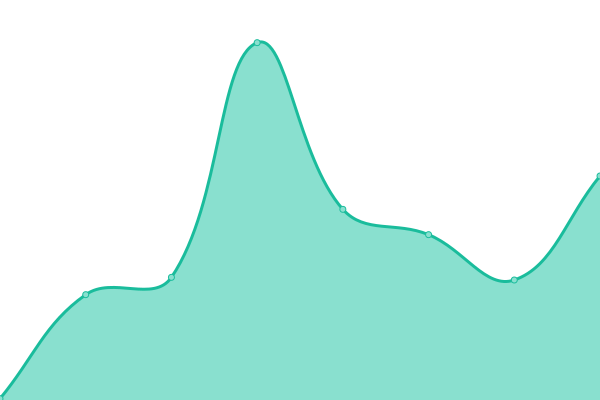

# [📈 Live Status](https://status.bricks4kidz.com): <!--live status--> **🟧 Partial outage**

This repository contains the open-source uptime monitor and status page for [Ajmal Alavi](https://status.bricks4kidz.com), powered by [Upptime](https://github.com/upptime/upptime).

With [Upptime](https://upptime.js.org), you can get your own unlimited and free uptime monitor and status page, powered entirely by a GitHub repository. We use [Issues](https://github.com/ajmalalavi/B4K-Site-monitor/issues) as incident reports, [Actions](https://github.com/ajmalalavi/B4K-Site-monitor/actions) as uptime monitors, and [Pages](https://status.bricks4kidz.com) for the status page.

<!--start: status pages-->
<!-- This summary is generated by Upptime (https://github.com/upptime/upptime) -->
<!-- Do not edit this manually, your changes will be overwritten -->
<!-- prettier-ignore -->
| URL | Status | History | Response Time | Uptime |
| --- | ------ | ------- | ------------- | ------ |
|  [CORP/US](https://www.bricks4kidz.com) | 🟩 Up | [corp-us.yml](https://github.com/ajmalalavi/B4K-Site-monitor/commits/HEAD/history/corp-us.yml) | 

 787ms
     
 | 

<a href="https://status.bricks4kidz.com/history/corp-us">100.00%</a>
    

|  [PANAMA](https://www.bricks4kidz.com.pa) | 🟩 Up | [panama.yml](https://github.com/ajmalalavi/B4K-Site-monitor/commits/HEAD/history/panama.yml) | 

 1721ms
     
 | 

<a href="https://status.bricks4kidz.com/history/panama">100.00%</a>
    

|  [MALTA](https://www.bricks4kidz.mt) | 🟩 Up | [malta.yml](https://github.com/ajmalalavi/B4K-Site-monitor/commits/HEAD/history/malta.yml) | 

 4576ms
     
 | 

<a href="https://status.bricks4kidz.com/history/malta">99.77%</a>
    

|  [IRELAND](https://www.bricks4kidz.ie) | 🟩 Up | [ireland.yml](https://github.com/ajmalalavi/B4K-Site-monitor/commits/HEAD/history/ireland.yml) | 

 1329ms
     
 | 

<a href="https://status.bricks4kidz.com/history/ireland">100.00%</a>
    

|  [LUXEMBURG](https://www.bricks4kidz.lu) | 🟩 Up | [luxemburg.yml](https://github.com/ajmalalavi/B4K-Site-monitor/commits/HEAD/history/luxemburg.yml) | 

 2859ms
     
 | 

<a href="https://status.bricks4kidz.com/history/luxemburg">100.00%</a>
    

|  [INDIA](https://www.bricks4kidz.in) | 🟥 Down | [india.yml](https://github.com/ajmalalavi/B4K-Site-monitor/commits/HEAD/history/india.yml) | 

 3018ms
     
 | 

<a href="https://status.bricks4kidz.com/history/india">99.99%</a>
    

|  [FRANCE](https://www.bricks4kidz.fr) | 🟩 Up | [france.yml](https://github.com/ajmalalavi/B4K-Site-monitor/commits/HEAD/history/france.yml) | 

 1577ms
     
 | 

<a href="https://status.bricks4kidz.com/history/france">100.00%</a>
    

|  [CHILE](https://www.bricks4kidz.cl) | 🟩 Up | [chile.yml](https://github.com/ajmalalavi/B4K-Site-monitor/commits/HEAD/history/chile.yml) | 

 782ms
     
 | 

<a href="https://status.bricks4kidz.com/history/chile">100.00%</a>
    

|  [POLAND](https://www.bricks4kidz.com.pl) | 🟩 Up | [poland.yml](https://github.com/ajmalalavi/B4K-Site-monitor/commits/HEAD/history/poland.yml) | 

 2010ms
     
 | 

<a href="https://status.bricks4kidz.com/history/poland">100.00%</a>
    

|  [SWITZERLAND](https://www.bricks4kidz.ch) | 🟩 Up | [switzerland.yml](https://github.com/ajmalalavi/B4K-Site-monitor/commits/HEAD/history/switzerland.yml) | 

 1586ms
     
 | 

<a href="https://status.bricks4kidz.com/history/switzerland">100.00%</a>
    

|  [SINGAPORE](https://www.bricks4kidz.com.sg) | 🟥 Down | [singapore.yml](https://github.com/ajmalalavi/B4K-Site-monitor/commits/HEAD/history/singapore.yml) | 

 1086ms
     
 | 

<a href="https://status.bricks4kidz.com/history/singapore">99.99%</a>
    

|  [MALAYSIA](https://www.bricks4kidz.my) | 🟥 Down | [malaysia.yml](https://github.com/ajmalalavi/B4K-Site-monitor/commits/HEAD/history/malaysia.yml) | 

 4162ms
     
 | 

<a href="https://status.bricks4kidz.com/history/malaysia">99.99%</a>
    

|  [AUSTRIA](https://www.bricks4kidz.at) | 🟩 Up | [austria.yml](https://github.com/ajmalalavi/B4K-Site-monitor/commits/HEAD/history/austria.yml) | 

 1732ms
     
 | 

<a href="https://status.bricks4kidz.com/history/austria">100.00%</a>
    

|  [ROMANIA](https://www.bricks4kidz.ro) | 🟩 Up | [romania.yml](https://github.com/ajmalalavi/B4K-Site-monitor/commits/HEAD/history/romania.yml) | 

 1951ms
     
 | 

<a href="https://status.bricks4kidz.com/history/romania">100.00%</a>
    

|  [MEXICO](https://www.bricks4kidz.mx) | 🟩 Up | [mexico.yml](https://github.com/ajmalalavi/B4K-Site-monitor/commits/HEAD/history/mexico.yml) | 

 1557ms
     
 | 

<a href="https://status.bricks4kidz.com/history/mexico">100.00%</a>
    

|  [MONGOLIA](https://www.bricks4kidz.mn) | 🟥 Down | [mongolia.yml](https://github.com/ajmalalavi/B4K-Site-monitor/commits/HEAD/history/mongolia.yml) | 

 3079ms
     
 | 

<a href="https://status.bricks4kidz.com/history/mongolia">99.99%</a>
    

|  [INDONESIA](https://www.bricks4kidz.co.id) | 🟥 Down | [indonesia.yml](https://github.com/ajmalalavi/B4K-Site-monitor/commits/HEAD/history/indonesia.yml) | 

 0ms
     
 | 

<a href="https://status.bricks4kidz.com/history/indonesia">0.00%</a>
    

|  [AUSRALIA](https://www.bricks4kidz.com.au) | 🟥 Down | [ausralia.yml](https://github.com/ajmalalavi/B4K-Site-monitor/commits/HEAD/history/ausralia.yml) | 

 1592ms
     
 | 

<a href="https://status.bricks4kidz.com/history/ausralia">99.99%</a>
    

|  [NIGERIA](https://www.bricks4kidz.ng) | 🟩 Up | [nigeria.yml](https://github.com/ajmalalavi/B4K-Site-monitor/commits/HEAD/history/nigeria.yml) | 

 2099ms
     
 | 

<a href="https://status.bricks4kidz.com/history/nigeria">100.00%</a>
    

|  [THAILAND](https://www.bricks4kidz.co.th) | 🟥 Down | [thailand.yml](https://github.com/ajmalalavi/B4K-Site-monitor/commits/HEAD/history/thailand.yml) | 

 3263ms
     
 | 

<a href="https://status.bricks4kidz.com/history/thailand">99.99%</a>
    

|  [UAE](https://www.bricks4kidz.ae) | 🟥 Down | [uae.yml](https://github.com/ajmalalavi/B4K-Site-monitor/commits/HEAD/history/uae.yml) | 

 3007ms
     
 | 

<a href="https://status.bricks4kidz.com/history/uae">99.99%</a>
    

|  [REUNION ISLAND](https://www.bricks4kidz.re) | 🟩 Up | [reunion-island.yml](https://github.com/ajmalalavi/B4K-Site-monitor/commits/HEAD/history/reunion-island.yml) | 

 2004ms
     
 | 

<a href="https://status.bricks4kidz.com/history/reunion-island">100.00%</a>
    

|  [LITHUANIA](https://www.bricks4kidz.lt) | 🟩 Up | [lithuania.yml](https://github.com/ajmalalavi/B4K-Site-monitor/commits/HEAD/history/lithuania.yml) | 

 970ms
     
 | 

<a href="https://status.bricks4kidz.com/history/lithuania">100.00%</a>
    

|  [TURKEY](https://www.bricks4kidz.com.tr) | 🟥 Down | [turkey.yml](https://github.com/ajmalalavi/B4K-Site-monitor/commits/HEAD/history/turkey.yml) | 

 1656ms
     
 | 

<a href="https://status.bricks4kidz.com/history/turkey">100.00%</a>
    

|  [FMS](https://us.bricks4kidznow.com) | 🟩 Up | [fms.yml](https://github.com/ajmalalavi/B4K-Site-monitor/commits/HEAD/history/fms.yml) | 

 891ms
     
 | 

<a href="https://status.bricks4kidz.com/history/fms">100.00%</a>
    

|  [UK](https://www.bricks4kidz.co.uk) | 🟩 Up | [uk.yml](https://github.com/ajmalalavi/B4K-Site-monitor/commits/HEAD/history/uk.yml) | 

 1668ms
     
 | 

<a href="https://status.bricks4kidz.com/history/uk">100.00%</a>
    

|  [PHILIPPINES](https://www.bricks4kidz.ph) | 🟥 Down | [philippines.yml](https://github.com/ajmalalavi/B4K-Site-monitor/commits/HEAD/history/philippines.yml) | 

 3305ms
     
 | 

<a href="https://status.bricks4kidz.com/history/philippines">100.00%</a>
    

|  [ITALY](https://www.bricks4kidz.it) | 🟩 Up | [italy.yml](https://github.com/ajmalalavi/B4K-Site-monitor/commits/HEAD/history/italy.yml) | 

 1143ms
     
 | 

<a href="https://status.bricks4kidz.com/history/italy">99.64%</a>
    

|  [NEW ZEALAND](https://www.bricks4kidz.co.nz) | 🟥 Down | [new-zealand.yml](https://github.com/ajmalalavi/B4K-Site-monitor/commits/HEAD/history/new-zealand.yml) | 

 1882ms
     
 | 

<a href="https://status.bricks4kidz.com/history/new-zealand">100.00%</a>
    

|  [CZECH REPUBLIC](https://www.bricks4kidz.cz) | 🟩 Up | [czech-republic.yml](https://github.com/ajmalalavi/B4K-Site-monitor/commits/HEAD/history/czech-republic.yml) | 

 1590ms
     
 | 

<a href="https://status.bricks4kidz.com/history/czech-republic">100.00%</a>
    

|  [COLUMIBIA](https://www.bricks4kidz.com.co) | 🟩 Up | [columibia.yml](https://github.com/ajmalalavi/B4K-Site-monitor/commits/HEAD/history/columibia.yml) | 

 1097ms
     
 | 

<a href="https://status.bricks4kidz.com/history/columibia">100.00%</a>
    

<!--end: status pages-->

[**Visit our status website →**](https://status.bricks4kidz.com)

## 📄 License

- Powered by: [Upptime](https://github.com/upptime/upptime)
- Code: [MIT](./LICENSE) © [Ajmal Alavi](https://status.bricks4kidz.com)
- Data in the `./history` directory: [Open Database License](https://opendatacommons.org/licenses/odbl/1-0/)
